|Block Name|Rule|Preview|
|----------------------|------------------------------------------------------------------------------------------------------------------------------------------------|------------------------------------------------------|
|2 truths & a lie|Tell 2 truths and a lie, everyone guesses what the lie is. You drink whenever someone guesses correctly||
|4 Eyes|Anyone with glasses drinks||
|Accent|Speak with an accent for the rest of the game||
|Archenemy|Give someone 4 drinks||
|arm wrestle|Arm wrestle with the person to your left. The loser drinks||
|Baby Talk|You can only speak in one syllable words||
|Backseat driver|Person to your left picks the piece you pull next turn|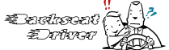|
|bar tender|You are now the bartender and have to fetch or mix everyones drinks||
|Batman|You have to talk like Batman||
|battle of the sexes|Opposite sex of you drinks||
|bipolar|compliment person to your right, insult person to your left|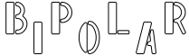|
|Blind man|For the rest of the game you have to pull the block out with your eyes shut||
|body guard|Pick someone to be your bodyguard, they must taste your drink before you drink it for the rest of the game||
|Boobs|All girls drink||
|BRO|If you make eye contact with someone you have ot say bro|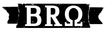|
|Buckle Up|you are now buckled in, you must undo and redo your seat belt when you get up||
|Can of Whoop-Ass|At any one time during the game someone gives you 2 or more drinks, you may give them 10 drinks in return.  If you are a Bodyguard, you may also do so if the drinks are given to the person you're guarding.	||
|Cannonball|Pick a Code Word.  If you hear this code word, you must destroy the tower and the person responsible drinks||
|Cartwheel|Pull a semi decent cartwheel and everyone else drinks - otherwise you drink||
|Categories|Pick a category, everyone must say something in that category. First person to Fails drinks|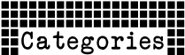|
|Censored|When you Swear, You Drink||
|Cheers|Give 2, take 2||
|Clothes Swap|Choose two players, they must swap a selected piece of clothing eith eacother|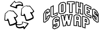|
|cocktail of doom|Everyone makes a shot for you to take. ||
|codenames|Other players give you a nickname that you are now refered by||
|compliments|give a compliment to everyone in the room||
|copycat|The last block now applies to you|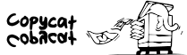|
|cray cray cat lady|drink for every cat you have ever owned||
|crypt keeper|oldest person drinks|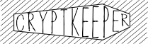|
|Deja Vu: |Previous person goes again!||
|Depersonalization|You can no longer call anyone by their names, and you cannot point at them. ||
|Dicks|All guys drink||
|Dicktator|As long as this block i s blanaced on your head you are impervious from any other blocks||
|Diddle Finger|you can only use one finger to remove blocks|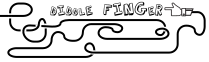|
|ditto|Pick someone to ditto for the rest of the game - When they Drink you Drink, When you Drink They Drink||
|Do Over|Put this piece back in the tower and pull a different one.        ||
|Double Hands|Use both hands when your handling your drink or pulling blocks||
|down the hatch|Finish your drink||
|drink pulling|On your next turn take a block while drinking||
|Drink swap|Swap your drink with someone elses||
|embryo|The youngest person dirnks|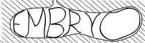|
|Eye Contact|Pull another block from the tower while maintaining eye contact with the person across from you||
|Fortune Teller|Predict who will cause the tower to fall. If your right pick someone to be a loser with them. Otherwise you drink with the loser||
|Game of Chicken|Give 1 drink. That player may give you back 1. You may then give them back another. Keep going until someone bails, they then have to drink the last given||
|Ghost|Reenact the scene from ghost, and help the next player remove their piece while behind them arms around their body||
|give 1|give 1||
|give 2|give 2, take 2||
|Give 3|give 3||
|God save the queen|If someone puts a coin in your drink you must drown it as the queen is drowning & its your civil duty to save her||
|Greedy Cunt|Take another block||
|Guess underwear colour|The player has to guess the other player's underwear colour, drinks for every wrong answer.|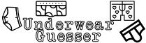|
|Gun Show|Bare your biceps and flex for everyone. players next to you drink for the view|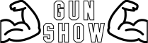|
|hand switch|Use your non-dominant hand to pull blocks||
|heads up|do not read aloud, throw this tile at someone. if they catch you drink otherwise they drink||
|i am groot|tallest person drinks||
|I'm a doctor, not a bricklayer!|Take a Drink and get someone else to put this block on the tower||
|Indecisive|Take another block and put it back||
|Jar Jar|You have to speak like JarJar Binks||
|Know it all|You are now the question master, if someone answers a question you ask they must drink - Lasts until used|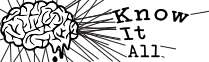|
|Lightning Round|Lighting round, going around every player till its back to you everyone only has 10 second to remove a block||
|make a rule|make a rule that stands for the rest of the game||
|Mamma Bird|Take a drink, but the person to your right pours it into your mouth|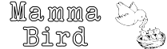|
|mini-me|The Shortest Person Drinks||
|Narcissist|Everyone Compliments you when they have to drink|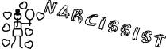|
|Neighbours|The two people next to you must drink|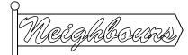|
|never have i ever|Make a statement about something youve never done, anyone who has done this drinks||
|No Depth Perception|For the rest of the game you must drink with your eyes closed.|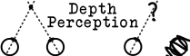|
|no guts no glory|you cant take any center pieces||
|not it|do not read aloud, the last player to touch there finger to their nose must drink 2||
|one must drink|everyone votes, person with most votes drinks||
|pass|Do not place on top of the tower. On a future turn you can place this piece instead of pulling a new piece||
|Pirate|YAAARRR, talk like a pirate |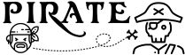|
|Point of No Return|You must take a tile from within 3 rows of the top for the rest of the game.||
|Psychiatrist|Describe an embarrassing personal moment and choose someone to analyze it. Both of you drink 1||
|Pushup|Everyone has to do 10 pushups or drink 2||
|Questions|Everyone speaks in questions, when someone doesnt they drink and its over||
|Quiet Please|Anyone who makes noise during your turn must drink, must "shh" at the beginning of your turn|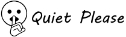|
|rainbow connection|pick a colour, everyone drinks if they are wearing that colour||
|Remove a Rule|Remove an rule from the game||
|Reverse|Order of play reverses|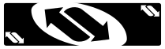|
|rewind|take a block from the top and put it back into the tower||
|Rhyme|Say a word, person to right has to say a word that rhymes with it. First person to not rhyme drinks||
|Rock, Paper, Scissors|On a count of 3, everyone throws down. You drink for every person who beats you. Every person you beat drinks 1|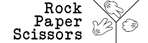|
|Roger Roger|You must finish every sentence with "Roger Roger"||
|Royale we|refer to yourself as the royal "We"||
|santa|sit on the person opposite lap until its your turn again||
|siblings|Drink 1 for every sibling you have||
|Skip|Skip the next player||
|slap|everyone gets a free gentle slap on you during the game||
|snake eyes|if anyone looks into your eyes for the rest of the game they drink||
|Soberesest|The least drunk person in the group has to drink|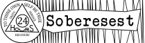|
|sociable drinking|everyone drinks||
|speech|make a 60 second speech||
|spin the bottle|spin the bottle, looser drinks||
|Staring Contest|Challenge someone to stare down first one to blink drinks.|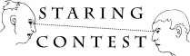|
|Swine Rulls|To talk to a person you have to point at them - you also have to swear constantly||
|t-rex arms|you must do everything with t-rex arms for the rest of the game, elbows touching your sides||
|take 1|Take 1||
|take 2|Take 3||
|take 2 and redo|Take 2 drinks and pull another tile||
|take 3|Take 3||
|the real slim shady|Stand up for the rest of the game||
|Thief|Take a drink of your neighbours drink|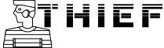|
|threeman|whenever a row is completed take a drink - if you complete a row you make someone else the threeman||
|time out|stand with your face in the corner of the room until your next turn. no talking or drinking|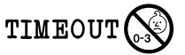|
|Touchy feely|Everyone must remove the first piece they touch||
|truth or date|Pick Truth or Dare||
|Wasted Education|Drink 1 for every year you spent in Uni that is now meaningless in your chosen profession.||
|Waterfall|You start drinking, person to your left starts and so on. When you stop person to your left stops and so on||
|Yes or No|Everyone asks you a Yes or No question. If you dont want to answer you drink|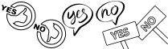|
